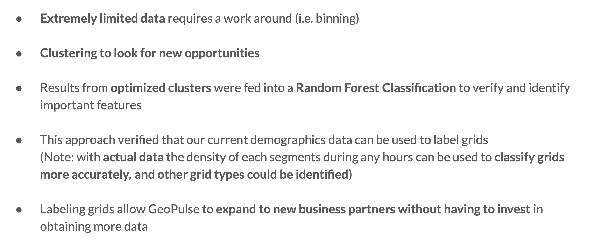

# DSI CAPSTONE - Geospatial Clustering to label grids

## Table of Content
[1. Executive Summary](#Executive-Summary) <br>
[2. Data Dictionary](#Data-Dictionary) <br>
[3. Repository Structure](#Repository-Structure) <br>
[4. File Description](#File-Description)

---

## Abstract

I was fortunate to be given the opportunity to work with a realworld dataset extracted from **True Analytic's** product called **GeoPulse**. This product specialises in customer persona based on location/time. For security reason, the dataset was greatly redacted that only 1% of the possible data was available. <br>

With this remaining data, I use unsupervised learning methods, **KMeans clustering**, to cluster up different customer segments based on population density with the aim of discovering new business opportunities. The results was then verified by feeding the labeled data into a **Random Forest Classifier**. Finally, the insights from each clusters allowed each cluster to be relabeled based on population density and location types. <br>

This kind of labeling allows True Analytics to potentially work with new customers by leveraging the already collected data to create new products without having to invest further in more data collection. New business partners may be logistic company looking to utilize their branches more efficiently or open new branch, might want to look for area of high density residential or high density community as they will be where logistic company send their packages to.

Note that with actual dataset, the labeling can be done in a much more efficient way and much more effectively. The possibility of business expansion without investment is defnitely intriguing.

---

## Summary

**GeoPulse** is a smart platform utilizing locational data, mobility data, internet data, and other sources combining them into a product specialises in analysing customer's persona within a specific area (referred to as grid) at a specific time. Currently **GeoPulse** has various use case in many industries that looks to utilize customer persona information such as businesses looking to open/close their branches, marketing strategy planning based on customer persona at each location, and foot traffic comparison for dynamic pricing of media products. <br>


The approach taken in this project was different from a typical Data Science project as show below: <br>

1. Obtain the data from GeoPulse team
2. Explore the data
3. Formula business ideas
4. Model to explore
5. Evaluate to verify
6. Conclude on business opportunities


<br>


Upon exploring the data there are a few limitations as listed below: <br>
1. Encoded area code makes locating grids relative to each other impossible
2. Information was acquired from only 1 out of 4 customer segments
3. Information was acquired from only 1 out of 24 hours of the day

Leaving us with approximately 1% of the available data. 

Data was prepared by binning the data set into 4 subsets separated by customer segments (worker, visitor, resident, work at home).

Unsupervised learning model used in this project is KMeans where the optimial number of clusters, identified by 'elbow method' and 'silhouette coefficients', is 4 for all segments.


Each segments were then clustered and label, and those labels were used as a target for Random Forest Classifier to verify how well the clusters are separated as well as identify the most important feature ('Population Density').

After labeling each subsets, the label were evaluated and relabeled using a more user friendly terms such as 'low density residential area'. These were decided using the following criteria: <br>

Density: <br>

- Low <= 40
- 40 < Medium <= 80
- 80 < High

Cluster Type: <br>

- Residential : Have residents all day except during working hours
- Community : Have residents all day including some residents during working hours (this grid has work available)
- Office : Worker mostly during work and afterwork
- Community_office : Worker approximately the same during morning and work time
- Public : Visitors during all hours (Note: at medium or high density)
- Others : Visitors during all hours (but low density level)
<br>


<br>

This method allows GeoPulse to expand their businesses to new partners without having to invest further into new data collection. Potential uses are: <br>
- Logistic company wanting to improve the delivery time by optimizing their offline branches/warehouses, and ultimately improving their customer satisfaction <br>
"Identify high density residential and community area"

- Dynamic pricing based on location and grid types <br>
"Different prices for worker-oriented accomodations around high density office area" 
<br>


**Conclusion**


**Note that with actual dataset, the grid types and density could be verified much more accurately and diversely.**

---

## Data Dictionary

Hidden for security purposes

---

## Repository Structure 
```
dsi_project_nlp
|
|__ code
|   |__ 00_data_cleaning.ipynb  
|   |__ 01_exploratory_data_analysis.ipynb
|   |__ 02_regression_check.ipynb
|   |__ 03_clustering_by_density_bin_segment.ipynb
|   |__ 04_clustering_by_density_bin_time_of_day.ipynb 
|  
|__ datasets
|   |__ reducted for security reasons
|
|__ README.md

```
<br>

---

## File Description
<br>

    00_data_cleaning.ipynb
- Combining files and cleaning up

<br>

    01_exploratory_data_analysis.ipynb
- Exploratory Data Analysis to understand the limitations of dataset

<br>

    02_regression_check.ipynb

- Experimental regression on the dataset to verify how each app usage / preferences columns can be predicted (spoiler: easily predicted based on just the population density)

<br>

    03_clustering_by_density_bin_segment.ipynb
- Clustering and relabeling based on subset division by customer segment

<br>

    04_clustering_by_density_bin_time_of_day.ipynb

- Clustering and relabeling based on subset division by time of the day